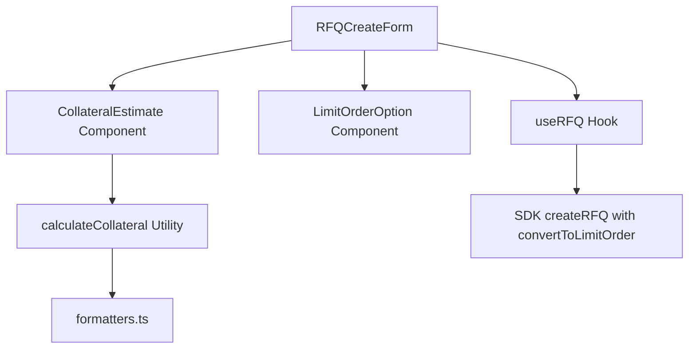

# Design Document: RFQ Form Enhancements

## Overview

This design adds collateral estimation, flexible contract sizes, and limit order conversion to the RFQ Create Form. The enhancements help users understand their collateral requirements before submitting an RFQ and provide the option to convert unfilled RFQs to limit orders.

## Code Reuse Analysis

### Existing Components to Leverage
- **`src/components/RFQCreateForm.tsx`**: Main form component to enhance
- **`src/components/Tooltip.tsx`**: HelpIcon component for tooltips
- **`src/utils/formatters.ts`**: formatPrice, formatStrike utilities
- **`src/types/rfq.ts`**: RFQFormState, OptionStructure types

### Integration Points
- **RFQCreateForm**: Add collateral display section and limit order checkbox
- **useRFQ hook**: Pass `convertToLimitOrder` flag to SDK
- **Form validation**: Update min contract size from 0.01 to 0.001

## Architecture



## Components and Interfaces

### Component 1: CollateralEstimate
- **Purpose:** Display estimated collateral required for short positions
- **File:** `src/components/CollateralEstimate.tsx`
- **Props:**
  ```typescript
  interface CollateralEstimateProps {
    isLong: boolean;
    optionType: OptionType;
    underlying: Underlying;
    structure: OptionStructure;
    strikes: number[];
    numContracts: number;
  }
  ```
- **Dependencies:** calculateCollateral utility, formatters
- **Reuses:** HelpIcon from Tooltip.tsx

### Component 2: LimitOrderOption
- **Purpose:** Checkbox to enable limit order conversion with reserve price
- **File:** Inline in RFQCreateForm (simple enough to not warrant separate file)
- **Behavior:**
  - Hidden when reserve price is empty
  - Shows checkbox + explanation when reserve price is set
  - Updates form state with `convertToLimitOrder` boolean

### Utility: calculateCollateral
- **Purpose:** Calculate estimated collateral based on option parameters
- **File:** `src/utils/collateral.ts`
- **Interface:**
  ```typescript
  interface CollateralResult {
    amount: number;
    token: 'USDC' | 'WETH' | 'cbBTC';
    formula: string;
  }

  function calculateCollateral(params: {
    optionType: OptionType;
    underlying: Underlying;
    structure: OptionStructure;
    strikes: number[];
    numContracts: number;
  }): CollateralResult
  ```

## Data Models

### Extended RFQFormState
```typescript
interface RFQFormState {
  // Existing fields...
  structure: OptionStructure;
  underlying: Underlying;
  optionType: OptionType;
  strikes: number[];
  expiry: number;
  numContracts: number;  // Now allows 0.001 minimum
  isLong: boolean;
  collateralToken: CollateralToken;
  offerDeadlineMinutes: number;
  reservePrice?: number;

  // New field
  convertToLimitOrder: boolean;  // Default: false
}
```

### CollateralResult
```typescript
interface CollateralResult {
  amount: number;        // Estimated collateral amount
  token: string;         // USDC, WETH, or cbBTC
  formula: string;       // Human-readable formula explanation
}
```

## Collateral Calculation Logic

Based on SDK documentation:

| Option Type | Collateral Token | Formula |
|-------------|------------------|---------|
| PUT (any structure) | USDC | Based on strike(s) |
| CALL + ETH underlying | WETH | Based on contracts |
| CALL + BTC underlying | cbBTC | Based on contracts |

### Formulas by Structure

```typescript
// Vanilla PUT: collateral = (numContracts * strike) / 1e8
// Vanilla CALL: collateral = numContracts (in underlying token)

// Spread: collateral = (numContracts * spreadWidth) / 1e8
// where spreadWidth = |strike2 - strike1|

// Butterfly: collateral = (numContracts * maxSpread) / 1e8
// where maxSpread = max(|strike2 - strike1|, |strike3 - strike2|)

// Condor/Iron Condor: collateral = (numContracts * maxSpread) / 1e8
// where maxSpread = max spread between any adjacent strikes
```

## UI Design

### Collateral Display Section (in Preview)
```
┌─────────────────────────────────────────┐
│ Estimated Collateral                    │
│ ────────────────────────────────────────│
│ ~1,500.00 USDC                     [?]  │
│ Formula: contracts × strike / 1e8       │
│                                         │
│ ⚠️ Actual amount determined at settle   │
└─────────────────────────────────────────┘
```

### Limit Order Option (below Reserve Price)
```
┌─────────────────────────────────────────┐
│ Reserve Price: [____50.00____]          │
│                                         │
│ ☐ Convert to limit order if no offers   │
│   If checked, RFQ becomes limit order   │
│   at your reserve price when deadline   │
│   passes with no offers.                │
└─────────────────────────────────────────┘
```

### Long Position Display
```
┌─────────────────────────────────────────┐
│ Collateral                              │
│ ────────────────────────────────────────│
│ No collateral required                  │
│ You pay premium only at settlement      │
└─────────────────────────────────────────┘
```

## Error Handling

### Error Scenarios
1. **Contract size too small**
   - **Handling:** Validation error on form submit
   - **User Impact:** "Minimum contract size is 0.001"

2. **Invalid strike configuration**
   - **Handling:** Prevent collateral calculation, show warning
   - **User Impact:** "Enter valid strike prices to see collateral estimate"

3. **Limit order without reserve price**
   - **Handling:** Hide checkbox when reserve price is empty
   - **User Impact:** N/A - option not shown

## Testing Strategy

### Unit Testing
- Test calculateCollateral for each option structure
- Test with edge cases (0.001 contracts, large strikes)
- Verify correct token selection based on option type

### Integration Testing
- Form submission with convertToLimitOrder flag
- Collateral display updates on input change
- Validation for minimum contract size

### End-to-End Testing
- Create RFQ with limit order conversion enabled
- Verify collateral estimate matches SDK calculations
