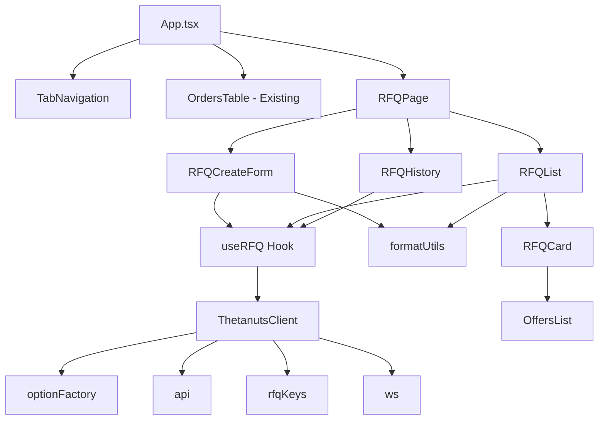

# Design Document: RFQ Trading Page

## Overview

The RFQ Trading Page adds a complete Request for Quotation interface to the Thetanuts Finance MVP. This feature enables users to create custom option requests, receive sealed-bid offers from market makers, and settle quotes after the offer period ends. The design follows existing patterns in the codebase while introducing new components for the RFQ lifecycle.

The page will be integrated as a tab-based navigation system alongside the existing Orderbook functionality, providing a seamless transition between instant fills (Orderbook) and custom quotes (RFQ).

## Steering Document Alignment

### Technical Standards
- React 18 with TypeScript 5.6 (strict mode)
- Vite 5.4 build system
- ethers.js v6 for Web3 interactions
- Tailwind CSS for styling (dark theme: bg-gray-900, bg-gray-800)
- Component-based architecture with hooks for state management

### Project Structure
Following existing patterns:
- Components in `src/components/`
- Hooks in `src/hooks/`
- Main layout in `src/App.tsx`
- SDK integration via `useThetanutsClient` hook

## Code Reuse Analysis

### Existing Components to Leverage
- **WalletConnect.tsx**: Reuse for wallet connection status (already in header)
- **TokenBalances.tsx**: Display collateral balances in RFQ form
- **OrdersTable.tsx**: Pattern for expandable rows, transaction status UI, loading states

### Existing Hooks to Leverage
- **useWallet.ts**: Wallet state, signer, network detection
- **useThetanutsClient.ts**: SDK client initialization, will be extended for RFQ operations

### Integration Points
- **ThetanutsClient**: SDK provides `client.optionFactory.*`, `client.api.*`, `client.rfqKeys.*`, `client.ws.*` modules
- **Chain Config**: Access to token addresses, contract addresses via `client.chainConfig`
- **ERC20 Module**: `client.erc20.ensureAllowance()` for collateral approvals

## Architecture

The RFQ page follows a container/presentational component pattern with shared state managed through React hooks.

### Modular Design Principles
- **Single File Responsibility**: Each component handles one concern (form, list, card, etc.)
- **Component Isolation**: RFQ components are self-contained with clear prop interfaces
- **Service Layer Separation**: SDK calls encapsulated in `useRFQ` hook
- **Utility Modularity**: Formatting utilities shared across components



## Components and Interfaces

### 1. TabNavigation Component
- **Purpose**: Toggle between Orderbook and RFQ pages
- **Location**: `src/components/TabNavigation.tsx`
- **Interfaces**:
  ```typescript
  interface TabNavigationProps {
    activeTab: 'orderbook' | 'rfq';
    onTabChange: (tab: 'orderbook' | 'rfq') => void;
  }
  ```
- **Dependencies**: None
- **Reuses**: Tailwind button styles from existing components

### 2. RFQPage Component
- **Purpose**: Container for RFQ functionality with sub-tabs (Create, Active, History)
- **Location**: `src/components/RFQPage.tsx`
- **Interfaces**:
  ```typescript
  interface RFQPageProps {
    client: ThetanutsClient;
    address: string | null;
    isConnected: boolean;
    isCorrectNetwork: boolean;
  }
  ```
- **Dependencies**: useRFQ hook, child components
- **Reuses**: Layout patterns from App.tsx

### 3. RFQCreateForm Component
- **Purpose**: Form for creating new RFQ requests
- **Location**: `src/components/RFQCreateForm.tsx`
- **Interfaces**:
  ```typescript
  interface RFQCreateFormProps {
    client: ThetanutsClient;
    address: string;
    onSuccess: (rfqId: string) => void;
  }

  interface RFQFormState {
    structure: 'vanilla' | 'spread' | 'butterfly' | 'condor' | 'iron-condor';
    underlying: 'ETH' | 'BTC';
    optionType: 'CALL' | 'PUT';
    strikes: number[];
    expiry: number; // Unix timestamp
    numContracts: number;
    isLong: boolean;
    collateralToken: 'USDC' | 'WETH' | 'cbBTC';
    offerDeadlineMinutes: number;
    reservePrice?: number;
  }
  ```
- **Dependencies**: client.optionFactory, client.rfqKeys, client.erc20
- **Reuses**: Input styles from OrdersTable form

### 4. RFQList Component
- **Purpose**: Display active RFQ requests with real-time updates
- **Location**: `src/components/RFQList.tsx`
- **Interfaces**:
  ```typescript
  interface RFQListProps {
    client: ThetanutsClient;
    address: string;
    onRFQSelect: (rfqId: string) => void;
  }
  ```
- **Dependencies**: client.api, client.ws
- **Reuses**: Table layout from OrdersTable

### 5. RFQCard Component
- **Purpose**: Expandable card showing RFQ details and offers
- **Location**: `src/components/RFQCard.tsx`
- **Interfaces**:
  ```typescript
  interface RFQCardProps {
    rfq: StateRfq;
    offers: StateOffer[];
    client: ThetanutsClient;
    isExpanded: boolean;
    onToggle: () => void;
    onSettle: () => void;
    onCancel: () => void;
  }
  ```
- **Dependencies**: OffersList, client.rfqKeys for decryption
- **Reuses**: Expandable row pattern from OrdersTable

### 6. OffersList Component
- **Purpose**: Display and decrypt offers for an RFQ
- **Location**: `src/components/OffersList.tsx`
- **Interfaces**:
  ```typescript
  interface OffersListProps {
    offers: StateOffer[];
    client: ThetanutsClient;
    rfqStatus: string;
  }

  interface DecryptedOfferDisplay {
    offeror: string;
    amount: bigint;
    nonce: bigint;
    isDecrypted: boolean;
  }
  ```
- **Dependencies**: client.rfqKeys.decryptOffer
- **Reuses**: Card styles

### 7. RFQHistory Component
- **Purpose**: Display settled and cancelled RFQs
- **Location**: `src/components/RFQHistory.tsx`
- **Interfaces**:
  ```typescript
  interface RFQHistoryProps {
    client: ThetanutsClient;
    address: string;
  }
  ```
- **Dependencies**: client.api.getUserRfqs
- **Reuses**: Table layout

### 8. useRFQ Hook
- **Purpose**: Encapsulate all RFQ-related SDK operations and state
- **Location**: `src/hooks/useRFQ.ts`
- **Interfaces**:
  ```typescript
  interface UseRFQReturn {
    // State
    activeRfqs: StateRfq[];
    historyRfqs: StateRfq[];
    loading: boolean;
    error: string | null;

    // Actions
    createRFQ: (params: RFQFormState) => Promise<string>;
    settleRFQ: (quotationId: bigint) => Promise<void>;
    cancelRFQ: (quotationId: bigint) => Promise<void>;
    refreshRFQs: () => Promise<void>;

    // Offers
    getOffersForRFQ: (rfqId: string) => Promise<StateOffer[]>;
    decryptOffer: (offer: StateOffer) => Promise<DecryptedOfferDisplay>;

    // Keys
    ensureKeyPair: () => Promise<RFQKeyPair>;

    // WebSocket
    subscribeToRFQ: (quotationId: bigint, callbacks: RfqSubscriptionCallbacks) => () => void;
  }
  ```
- **Dependencies**: ThetanutsClient
- **Reuses**: Pattern from useThetanutsClient

## Data Models

### StateRfq (from SDK)
```typescript
interface StateRfq {
  id: string;                    // Quotation ID
  requester: string;             // User address
  optionType: number;            // 0=CALL, 1=PUT
  strikes: string[];             // Strike prices (8 decimals)
  expiry: number;                // Unix timestamp
  numContracts: string;          // Number of contracts
  isRequestingLongPosition: boolean;
  collateralToken: string;       // Token address
  reservePrice: string;          // Min acceptable price
  status: 'active' | 'settled' | 'cancelled';
  createdAt: number;
  offerDeadline: number;         // Unix timestamp
  offers?: Record<string, StateOffer>;
}
```

### StateOffer (from SDK)
```typescript
interface StateOffer {
  quotationId: string;
  offeror: string;
  signingKey: string;            // Offeror's public key
  signedOfferForRequester: string; // Encrypted offer data
  status: 'pending' | 'revealed' | 'settled';
  timestamp: number;
}
```

### RFQFormState (internal)
```typescript
interface RFQFormState {
  structure: 'vanilla' | 'spread' | 'butterfly' | 'condor' | 'iron-condor';
  underlying: 'ETH' | 'BTC';
  optionType: 'CALL' | 'PUT';
  strikes: number[];             // Human-readable (e.g., 2500)
  expiry: number;                // Unix timestamp
  numContracts: number;
  isLong: boolean;
  collateralToken: 'USDC' | 'WETH' | 'cbBTC';
  offerDeadlineMinutes: number;
  reservePrice?: number;
}
```

### TransactionState (internal)
```typescript
interface TransactionState {
  status: 'idle' | 'approving' | 'submitting' | 'success' | 'error';
  hash: string | null;
  error: string | null;
}
```

## Error Handling

### Error Scenarios

1. **Wallet Not Connected**
   - **Handling**: Disable form submission, show connect prompt
   - **User Impact**: Clear message to connect wallet

2. **Wrong Network**
   - **Handling**: Disable form submission, show network switch button
   - **User Impact**: "Please switch to Base network" with action button

3. **Invalid Form Input**
   - **Handling**: Client-side validation with inline error messages
   - **User Impact**: Red border on invalid fields, descriptive error text

4. **Expiry Validation Failed**
   - **Handling**: Check expiry is Friday 8:00 UTC, in the future
   - **User Impact**: "Expiry must be Friday 8:00 UTC and in the future"

5. **Insufficient Collateral (Short Position)**
   - **Handling**: Check balance before submission
   - **User Impact**: "Insufficient WETH balance for collateral"

6. **Transaction Rejected by User**
   - **Handling**: Reset form state, show cancelled message
   - **User Impact**: "Transaction cancelled by user"

7. **Transaction Failed On-chain**
   - **Handling**: Parse error, show revert reason
   - **User Impact**: "Transaction failed: [reason]" with retry option

8. **Offer Decryption Failed**
   - **Handling**: Show "Encrypted offer" placeholder
   - **User Impact**: Graceful degradation, offer still visible as pending

9. **WebSocket Disconnection**
   - **Handling**: Auto-reconnect with exponential backoff
   - **User Impact**: Connection status indicator, manual reconnect button

10. **API Request Failed**
    - **Handling**: Retry with backoff, cache stale data
    - **User Impact**: "Failed to load RFQs. Retrying..." with refresh button

## Testing Strategy

### Unit Testing
- **Components**: Test rendering with various props, user interactions
- **Hooks**: Test state management, SDK method calls
- **Utilities**: Test formatting functions with edge cases
- **Key components to test**: RFQCreateForm validation, OffersList decryption logic

### Integration Testing
- **Form → SDK**: Test RFQ creation flow with mocked SDK
- **WebSocket**: Test real-time update integration
- **Key flows**: Create RFQ → Receive Offer → Settle

### End-to-End Testing
- **User scenarios**:
  1. Connect wallet → Create vanilla RFQ → View in active list
  2. Create spread RFQ with collateral approval
  3. View offers → Settle RFQ after deadline
  4. Cancel RFQ with no offers
  5. Real-time offer notification

## UI Layout

### Main Navigation
```
[Orderbook] [RFQ]  ← Tab buttons at top of main content
```

### RFQ Page Sub-Navigation
```
[Create] [Active (3)] [History]  ← Pills/tabs within RFQ section
```

### Create Form Layout
```
┌─────────────────────────────────────────────┐
│ Create RFQ Request                          │
├─────────────────────────────────────────────┤
│ Structure: [Vanilla ▼]                      │
│                                             │
│ Underlying: [ETH] [BTC]                     │
│ Option Type: [CALL] [PUT]                   │
│                                             │
│ Strike Price: [$__________]                 │
│ (More strikes shown based on structure)     │
│                                             │
│ Expiry: [Date Picker - Fridays only]        │
│ Contracts: [___________]                    │
│ Position: [Long] [Short]                    │
│                                             │
│ Collateral: [USDC ▼]                        │
│ Offer Deadline: [6] minutes                 │
│ Reserve Price: [$_______] (optional)        │
│                                             │
│ ┌─────────────────────────────────────────┐ │
│ │ Preview                                 │ │
│ │ Est. Collateral: 1,250 USDC            │ │
│ │ Offer Period Ends: 12:30 UTC           │ │
│ └─────────────────────────────────────────┘ │
│                                             │
│        [Create RFQ Request]                 │
└─────────────────────────────────────────────┘
```

### Active RFQ Card (Expanded)
```
┌─────────────────────────────────────────────┐
│ RFQ #42  ETH PUT $2,500  Exp: Mar 28        │
│ 10 contracts • Long • USDC                  │
│ Status: Active • Offers: 3 • Ends: 5:32     │
├─────────────────────────────────────────────┤
│ Offers (sorted by best price):              │
│ ┌─────────────────────────────────────────┐ │
│ │ 0x1234...abcd  $45.50/contract  BEST   │ │
│ │ 0x5678...efgh  $44.20/contract         │ │
│ │ 0x9abc...ijkl  Encrypted (pending)     │ │
│ └─────────────────────────────────────────┘ │
│                                             │
│        [Cancel]  [Settle - Available 5:32]  │
└─────────────────────────────────────────────┘
```

## File Structure

```
src/
├── components/
│   ├── TabNavigation.tsx      # Main tab navigation
│   ├── RFQPage.tsx            # RFQ container with sub-navigation
│   ├── RFQCreateForm.tsx      # Form for creating RFQs
│   ├── RFQList.tsx            # Active RFQ list
│   ├── RFQCard.tsx            # Expandable RFQ card
│   ├── OffersList.tsx         # Offers display with decryption
│   ├── RFQHistory.tsx         # Historical RFQs
│   ├── ExpiryPicker.tsx       # Friday-only date picker
│   ├── OrdersTable.tsx        # (existing)
│   ├── TokenBalances.tsx      # (existing)
│   └── WalletConnect.tsx      # (existing)
├── hooks/
│   ├── useRFQ.ts              # RFQ state and operations
│   ├── useWallet.ts           # (existing)
│   └── useThetanutsClient.ts  # (existing)
├── utils/
│   └── formatters.ts          # Shared formatting utilities
├── types/
│   └── rfq.ts                 # RFQ-specific type definitions
├── App.tsx                    # Updated with tab navigation
├── main.tsx                   # (existing)
└── index.css                  # (existing)
```
