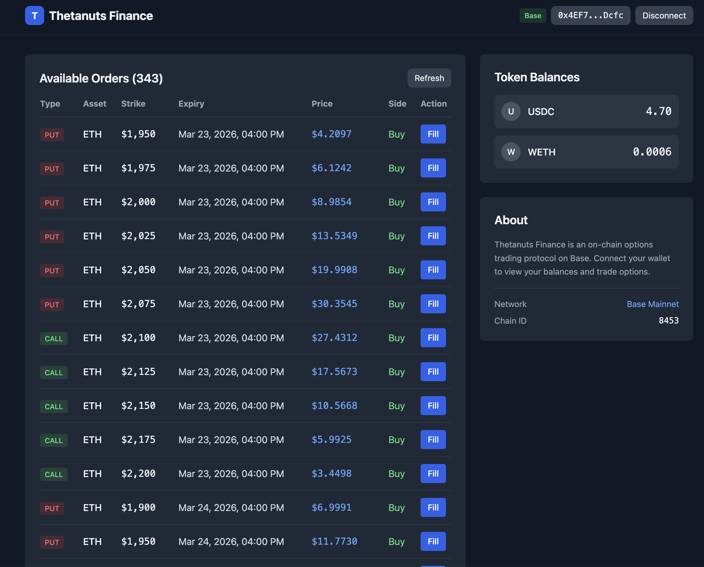
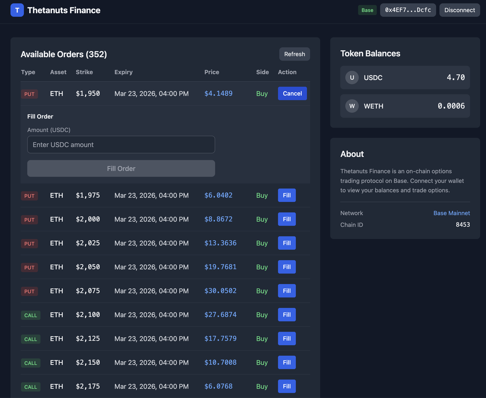

# Thetanuts Finance MVP Frontend

A minimal frontend for interacting with the Thetanuts Finance options trading protocol on Base mainnet.

## Screenshots





## Features

- **Wallet Connection** - Connect MetaMask to Base mainnet
- **View Orders** - Browse available options orders (CALL/PUT)
- **Fill Orders** - Execute trades with USDC approval flow
- **Token Balances** - View USDC and WETH balances

## Tech Stack

- React 18 + TypeScript
- Vite
- Tailwind CSS
- ethers.js v6
- @thetanuts-finance/thetanuts-client SDK

## Getting Started

### Prerequisites

- Node.js 18+
- MetaMask wallet
- Base mainnet ETH for gas

### Installation

```bash
npm install
```

### Development

```bash
npm run dev
```

Open http://localhost:5173 in your browser.

### Build

```bash
npm run build
```

## Usage

1. Click "Connect Wallet" to connect MetaMask
2. Switch to Base network if prompted
3. Browse available options orders
4. Click "Fill" on any order to trade
5. Enter USDC amount and confirm transaction

## SDK Reference

This project uses the [@thetanuts-finance/thetanuts-client](https://www.npmjs.com/package/@thetanuts-finance/thetanuts-client) SDK.

Key methods used:
- `client.api.fetchOrders()` - Fetch available orders
- `client.erc20.getBalance()` - Check token balances
- `client.erc20.ensureAllowance()` - Approve tokens
- `client.optionBook.fillOrder()` - Execute order fill

## License

MIT
